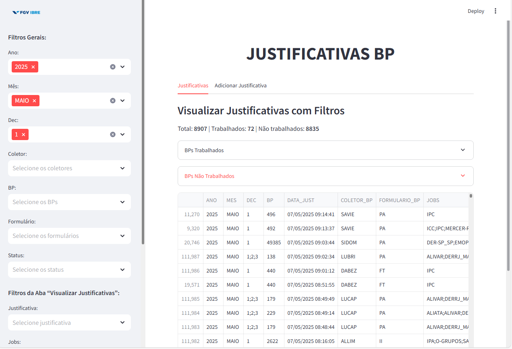

# Guia de Uso – App Justificativa BP

> **Visão Geral:**  
> O **App Justificativa BP** permite filtrar, visualizar, exportar e adicionar justificativas de forma rápida e centralizada, integrando-se ao Snowflake.

---

## 📥 1. Acesso à Ferramenta

1. Abra seu navegador e acesse a URL do repositório de aplicaçoes:  
   ```
   https://spdorepositorioapps.streamlit.app/
   ```
2. Em seguida, coloque o usuário e senha de acesso a ferramenta.
3. Após feito o login, navegue no menu lateral e escolha a opção "Coleta Tradicional"
4. Selecione a ferramenta "App Justificativa"
5. Selecione a opção "Acessar App" que dara acesso para o app (Tem também a opção "Tutorial", que da acesso a esse tutorial que está sendo utilizado)


---

## 🖥️ 2. Layout da Tela



- **Cabeçalho:** “JUSTIFICATIVAS BP” centralizado.  
- **Barra lateral:** todos os filtros.  
- **Corpo:** duas abas—“Justificativas” e “Adicionar Justificativa”.

---

## ⚙️ 3. Sidebar – Filtros Comuns


### 3.1 Botão “🔄 Limpar Filtros”  
- Reseta **todos** os campos da sidebar de uma vez.

### 3.2 Filtros Gerais  
| Filtro         | Descrição                                                                 |
| -------------- | ------------------------------------------------------------------------- |
| **Ano**        | Selecione um ou mais anos disponíveis.                                    |
| **Mês**        | Em português (JANEIRO, FEVEREIRO, …).                                     |
| **Decêndio**   | 1 (dias 1–10), 2 (11–20) ou 3 (21–fim do mês).                             |
| **Coletor**    | Nome do coletor BP.                                                       |
| **BP**         | Identificação do BP.                                                      |
| **Formulário** | Tipo de formulário BP.                                                    |
| **Status**     | Status de pesquisa (e.g. “AINDA NÃO TRABALHADO”, “CONCLUÍDA”).             |

---

## 🔎 4. Sidebar – Filtros da Aba “Visualizar Justificativas”


### 4.1 Justificativa  
- **Todos**: mostra com e sem texto.  
- **Preenchido**: apenas registros com justificativa.  
- **Não Preenchido**: sem texto.

### 4.2 Jobs  
- Multiseleção de um ou mais jobs (campo “JOBS” no banco).

### 4.3 Datas  
- **Data Inicial:** formato **DD/MM/AAAA**.  
- **Data Final:** formato **DD/MM/AAAA**.  

---

## 📊 5. Aba “Justificativas”


1. **Aplicação dos filtros:** todos os controles são lidos da sidebar.  
2. **Indicadores:**  
   ```text
   Total |  Trabalhados  |  Não trabalhados | BPs Trabalhados | Bps Não Trabalhados
   ```  

3. **Grid de Resultados:**  
   - **Colunas:**  
     ```text
     ANO | MES | DEC | BP | DATA_JUST | COLETOR_BP | FORMULARIO_BP 
     | JOBS | COLETOR_PESQ | FORMULARIO_PESQ | STATUS_PESQ | JUSTIFICATIVA
     ```  
   - Altura fixa e rolagem interna.  
   - Paginação automática por setas ◀️ ▶️ no rodapé da grid.

4. **Exportar Excel:**  
   - Clique em **“Baixar lista de justificativas”** para gerar um arquivo `.xlsx` com todos os registros filtrados.

---

## ✍️ 6. Aba “Adicionar Justificativa”


1. **Filtros aplicados:** reaplica todos os filtros comuns da sidebar (Ano, Mês, Decêndio etc.).  
2. **Lista de BPs pendentes:**  
   - Agrupa por **BP + Mês** e exibe apenas registros com `STATUS_PESQ ≠ CONCLUÍDA`.  
3. **Formulário Inline:** para cada BP listado:  
   - **Formulário Pesq.:** lista de formulários disponíveis.  
   - **Status:** lista de status de pesquisa.  
   - **Coletor Pesq.:** lista de coletores.  
   - **Justificativa:** campo de texto (até 500 caracteres).  
4. **Salvar Justificativa:**  
   - Atualiza (ou insere) o registro em um banco de dados dedicado.  
   - Exibe **“Justificativa salva com sucesso!”** e limpa o form naquele BP.


---

## 💡 7. Boas Práticas

- **Selecione primeiro** todos os filtros antes de navegar entre as abas.  
- Use **“🔄 Limpar Filtros”** sempre que quiser reiniciar suas consultas.  
- Para períodos longos, ajuste com cuidado a **Data Inicial** e **Data Final**.  
- Navegue entre páginas usando as setas ◀️ ▶️ na aba “Justificativas”.  

---
