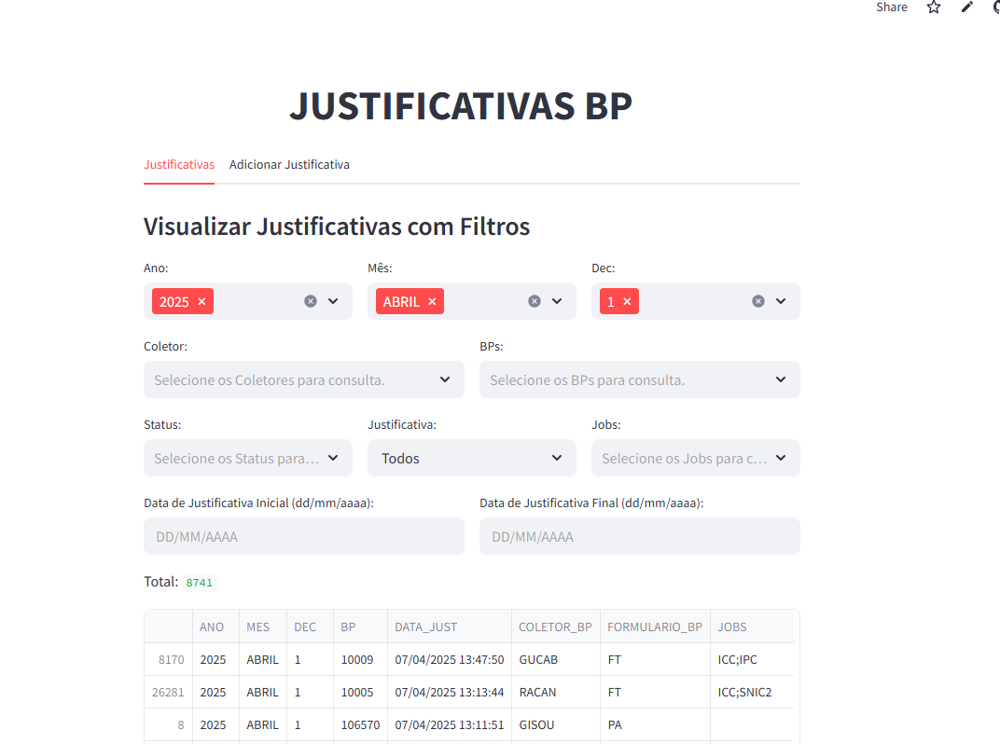
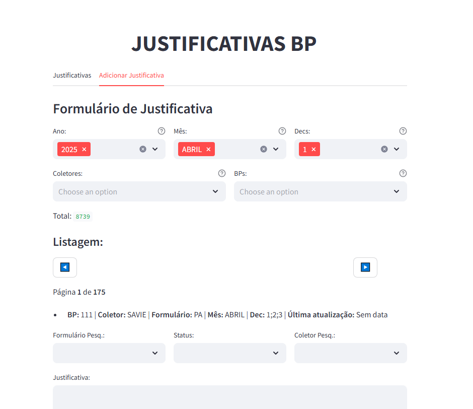

# Tutorial de Uso – JUSTIFICATIVAS BP

Este aplicativo permite que você visualize, filtre e atualize as justificativas de registros de forma simples e interativa. A seguir, veja como navegar e utilizar as principais funcionalidades do app.

---

## Visão Geral

A aplicação possui duas abas principais:

- **Justificativas:**  
  Visualize e filtre os registros existentes com base em diversos critérios (Ano, Mês, Dec, Coletores, BPs, Status, Jobs e intervalo de datas).  
  Você pode também exportar os dados filtrados para um arquivo Excel.

- **Adicionar Justificativa:**  
  Preencha ou atualize justificativas para os registros que necessitam de atenção.  
  A navegação é paginada, facilitando o preenchimento de muitos formulários.

---

## Como Utilizar a Aba "Justificativas"

1. **Aplicando Filtros:**
   - **Ano:** Selecione os anos desejados para a consulta.
   - **Mês:** Escolha o(s) mês(es) (utilize o nome do mês, ex.: "JANEIRO", "FEVEREIRO", etc.).
   - **Dec:** Selecione o decêndio com base no dia atual (1, 2 ou 3).
   - **Coletores e BPs:** Use os menus para filtrar por Coletores e BPs disponíveis.
   - **Status:** Selecione o status da pesquisa (através dos valores disponíveis).
   - **Justificativa:** Escolha entre "Todos", "Preenchido" ou "Não Preenchido".
   - **Jobs:** Caso haja, filtre pelos Jobs.

   Além desses filtros, você pode informar um intervalo de datas (Data de Justificativa Inicial e Final) no formato `dd/mm/aaaa` para refinar os resultados.

2. **Visualizando os Registros:**
   - Após aplicar os filtros, a tabela será atualizada e exibirá os registros correspondentes.
   - Os registros são ordenados por data e BP, facilitando a identificação dos dados mais recentes.

3. **Exportando os Dados:**
   - Clique no botão **"Baixar lista de justificativas"** para exportar a tabela filtrada para um arquivo Excel, permitindo que você salve ou compartilhe os dados conforme necessário.

---

## Como Utilizar a Aba "Adicionar Justificativa"

1. **Filtrando Registros para Preenchimento:**
   - Selecione os filtros de **Ano**, **Mês** e **Dec** para visualizar os registros que precisam de justificativas.
   - Você pode refinar ainda mais os registros utilizando os filtros de **Coletores** e **BPs**.

2. **Preenchendo o Formulário:**
   - Para cada registro listado, o formulário exibe informações como BP, Coletores, Formulário e a data da última atualização.
   - Utilize os menus suspensos para:
     - Selecionar o **Formulário Pesq.**,
     - Escolher o **Status**,
     - Indicar o **Coletor Pesq.**.
   - Insira a justificativa no campo de texto (máximo de 500 caracteres).

3. **Navegação e Paginação:**
   - Caso haja muitos registros, utilize os botões **"◀️"** e **"▶️"** para navegar entre as páginas de formulários.
   - O app indica a página atual e o total de páginas disponíveis.

4. **Salvando as Justificativas:**
   - Após preencher os campos obrigatórios para os registros desejados, clique no botão **"Salvar justificativas da página"** para enviar as atualizações.
   - Uma mensagem de sucesso será exibida indicando quais registros foram salvos/atualizados.

5. **Atualizando a Página:**
   - Caso queira recarregar os registros ou atualizar os filtros, utilize o botão **"Recarregar página"**.

---

## Dicas de Uso

- **Formato de Data:**  
  Sempre informe as datas no formato `dd/mm/aaaa` para evitar erros no filtro por intervalo de datas.

- **Campos Obrigatórios:**  
  Certifique-se de preencher os campos obrigatórios (Formulário Pesq., Status e Coletor Pesq.) para que o registro seja salvo corretamente.

- **Filtros Dinâmicos:**  
  Se nenhum registro for encontrado para os filtros aplicados, revise os critérios ou limpe alguns filtros para ampliar a busca.

---
